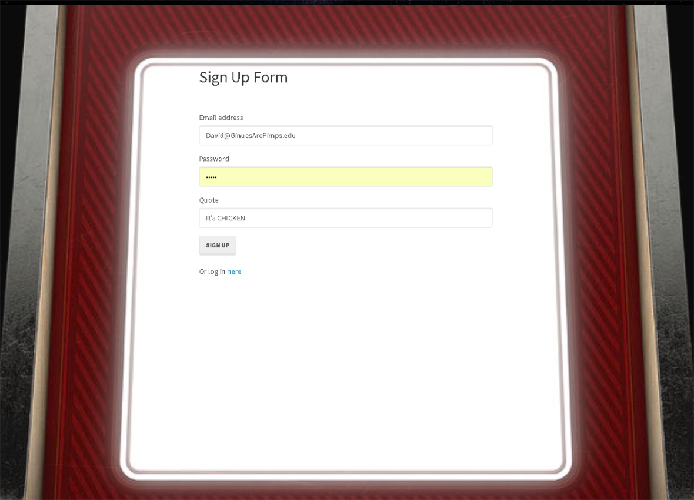
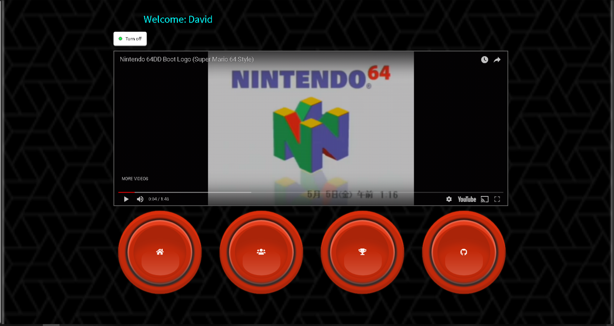
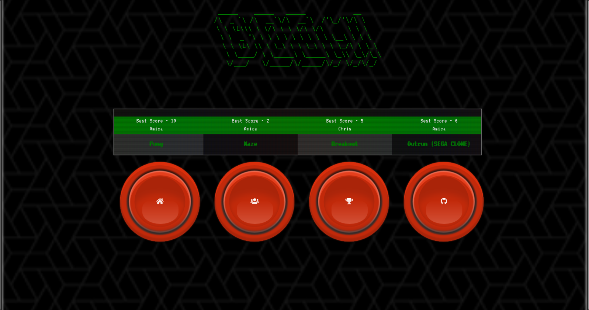
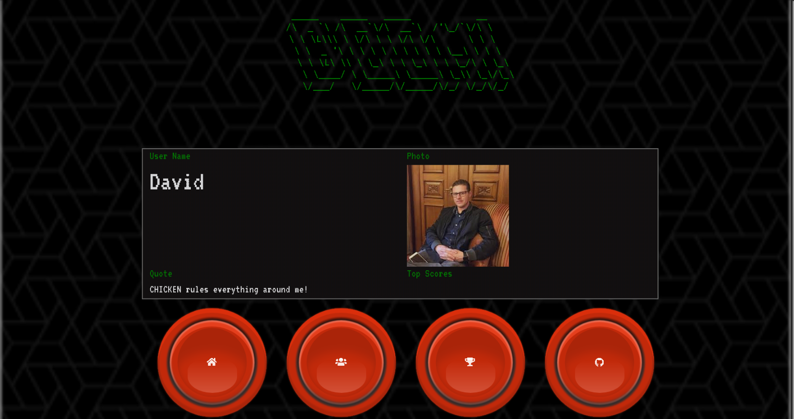
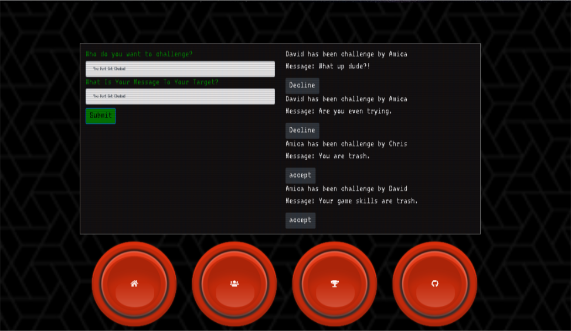

# BOOM!

## The Comprehensive game site for web developers. 

## Motivation and Description: 

 Asked as a group to create a website utilizing API calls, Node, Express Web server, Sequelize where we can have GET and POST routes for retrieving and adding new data. The authors each had ideas of sites they would like to build. Unable to immediately come to a consensus, the idea we all had agreement to make a comprehensive game site for Web Developers with many features.

## Instructions to use:

Main page -- Simply Login or sign up in the provided field and click the submit button.

Member’s page – On top will display your email that you signed up with. Following there is button to turn on/off T.V. You will see four buttons below and each one has different functionality.

•	First HOME button which will take to our game page where you will make your game choice and play.

•	Second PROFILE button will take you to profile page where will upload your photo and choose or write your Quote.

 

•	Third CHALLENGE button, will lead you to challenge your friends.

•	Fourth GITHUB button will send you to Github repository.

## Technologies Used:
HTML, SCSS, JavaScript, Sequelize, Node, Express Web Server, Eslint, Passport

## Credits:
* Brogan Stich - Html, UI, Page styling

* Chris Meeder - Html, game logic, page styling
* Isaac Romero - Routes, Database 
* Amico Kaur - Models, Challenge Routes, ReadMe 
